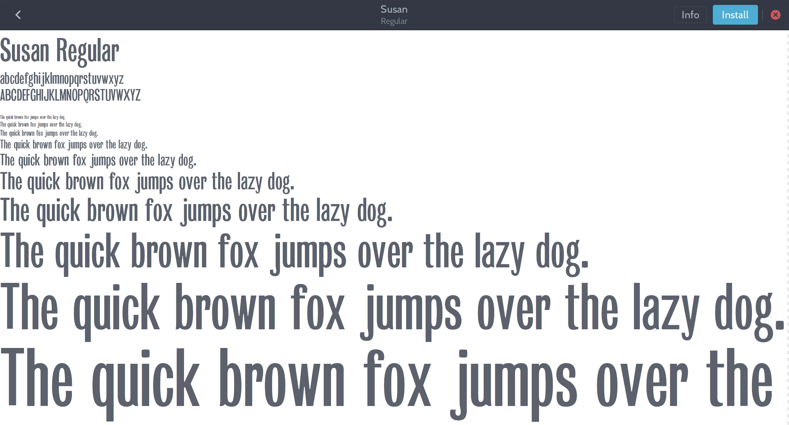

## Susan

_Susan_ was a project aiming to recreate the grotesque typeface used in the end credits of the first [_Doctor Who_](http://en.wikipedia.org/wiki/Doctor_Who) serials from the BBC. I’m unlikely to keep going with this project now.

* http://avant.probablement.net/susan
* http://avant.probablement.net/susan/archive

### About the name

Susan is the name of [the Doctor’s granddaughter](http://en.wikipedia.org/wiki/Susan_Foreman), the first character to travel with him through space and time.

### About the design

The BBC designers seems to have used a grotesque typeface from Stephenson Blake, or a variant thereof. The foundry Stephenson Blake, which closed in the 1990s, had in their 19th century catalogue grotesque designs similar to the one used onscreen. Today equivalents include:

* *Bureau Grot* (formerly *Grotesque*) by Font Bureau (1989)
* *Grotesque No 9* by URW++ (2000)
* *Grotesque 6* by Émilie Rigaud (2010)
* *Brezel* by MilieuGrotesque (2011)
* *Susan* — the one you’re currently looking at :)

### About the font

The repository archives a very early state of the font from the summer of 2015. The 26 latin letters has been traced from the title cards. Uppercase and lowercase. If anything, it’s a pre-drawing, clumsy at best, with great room to improve upon. No diacritics, punctuation, figures, other alphabet, kerning, or anything else. Hosted here are an initial source file for Fontforge and a raw OpenType export.

The files are licensed under [SIL OFL](http://scripts.sil.org/OFL).

* See also : [FONTLOG.md](FONTLOG.md)

---

Preview of the font’s current state ↓

---

Part of the drawing reference ↓

